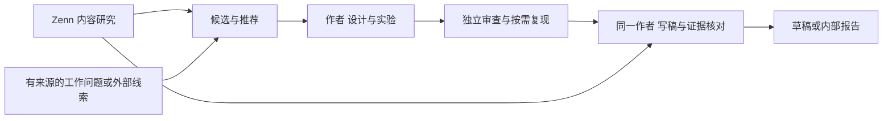

# 假说验证博客管道

从有来源的问题出发，做实验、判断证据，再写成值得读的技术内容。可信度、点赞与注目度同时重要：选题回答读者的问题，文章兑现标题承诺。

先看 [REPORT.md](REPORT.md) 了解本轮结果；共享流程只定义在 [policy.json](policy.json)，数据格式只定义在[证据契约](skills/evidence-check/references/contract.md)。整个 `_pipeline/` 是可搬走的完整包，不需要已有全局 skill。



## 开始一次研究

先写一份 brief，说明实际问题及来源、目标读者、可用材料、资源授权和输出用途。默认作者沿用一个会话，独立审查和复现另开会话；需要人的判断如何处理，见共享政策。

可以直接让 AI 阅读本入口与相关 skills，在新的 `runs/课题名/` 中完成研究。自动运行需要 Python、npm 和已登录的 Codex，配置见 [runtime.json](runtime.json)；当前后端是 Codex。命令在本目录执行：

```powershell
python scripts/pipeline.py runs/my-study --brief my-brief.md
```

`my-brief.md` 换成自己的文件。现有 [brief-example.md](templates/brief-example.md) 仅用于安装试跑，不代表真实工作课题。查看证据状态不调用模型；继续时恢复已有作者会话：

```powershell
python scripts/pipeline.py runs/my-study --verify
python scripts/pipeline.py runs/my-study --resume
```

候选会写入 `topic-options.json`。默认按推荐项继续；要亲自选，可先加 `--through topic`，再用 `--resume --topic-choice 候选ID`，或写入 `topic-choice.json`（`{"id":"候选ID"}`）。需要单独复现时加 `--reproduce`。每次研究的 `pipeline-report.json` 汇总提示与返工，`rework.jsonl` 保留逐问题次数。

研究目录保留原始结果、会话记录与断点。材料变化时先查实际差异，不手改散列伪装一致；运行故障和需要人判断的分歧写入报告。

## 需要哪个 skill

| 职责 | 读什么 | 留下什么 |
|---|---|---|
| [选题](skills/topic-hypothesis/SKILL.md) | 来源、读者、内容研究 | `hypothesis.md`、初始 `run.json` |
| [设计](skills/experiment-design/SKILL.md) | 假说、可用输入 | `experiment-plan.md`、校准结果 |
| [执行](skills/experiment-run/SKILL.md) | 方案与环境 | `results/`、`execution.md` |
| [审查](skills/experiment-review/SKILL.md) | 先原始材料，后作者结论 | `review.md`、按需复现记录 |
| [写作](skills/content-write/SKILL.md) | 可支持结论与内容建议 | `article.md`、`editorial.md` |
| [证据对照](skills/evidence-check/SKILL.md) | 文章、断言及来源 | `claims.json`、`gate.json` |
| [内容研究](skills/content-research/SKILL.md) | 传播问题、Zenn 样本 | `content-brief.md` |

职责按需要调用；不用为了流程重写已有材料。实验设计中的真实任务校准和天花板预检见设计 skill；gate 只核对机械事实，不能替代研究判断。

## 内容研究与核对

Zenn 的 [FINDINGS.md](research/zenn/FINDINGS.md) 提供选题、标题与正文案例；[SAMPLING.md](research/zenn/SAMPLING.md) 说明样本范围；[OPERATIONS.md](research/zenn/OPERATIONS.md) 给出采集与复算方法。现有研究是相关性观察，发布前不能宣称已经提高点赞。

单独检查一个研究目录：

```powershell
python skills/evidence-check/scripts/gate.py check runs/my-study --output runs/my-study/gate.json
```

数字来源、执行记录及扫描方式见证据契约；提示与阻断、修正次数和授权边界见共享政策。目录中的 `archive/` 保留旧轮次和历史测试，当前交付以总报告链接为准。

旧研究的可用入口：[检索研究](runs/retrieval-v4/README.md)、[审查研究](runs/review-behavior/README.md)。历史执行文档中的旧路径保持原样，新复现命令见这些入口。
