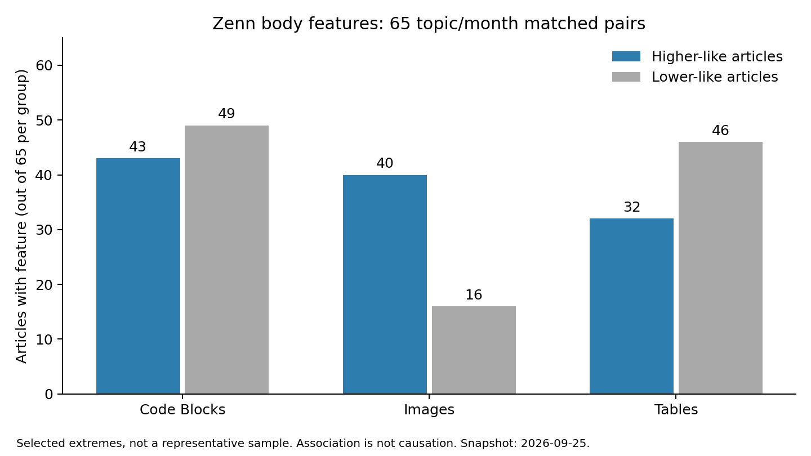

# Zenn 研究：优先做“读者关心的具体问题 + 自己验证出的差异”，不要套爆款公式

**课题**：公司博客除了可信，还要有人关注、愿意点赞。本轮研究用真实 Zenn 数据给选题、标题与正文设计提供依据，不能用研究质量代替传播 KPI。

**为什么这样判断**：标题问句、正文图片出现了值得继续验证的信号；“有数字”“写了検証”“代码多”“表格多”没有表现出通用优势。低赞样本也有扎实 PoC，说明技术内容好并不自动获得曝光。

**预期效果**：选题先找到具体读者与争议点，标题准确承诺一个值得知道的发现，正文提供可复用证据。是否提高点赞需要发布后的读者数据，本轮没有发布，不能宣称已经改善 KPI。

## 实际采到了什么

观测日期：2026-09-25。现场读取了 [robots](https://zenn.dev/robots.txt)、[条款](https://zenn.dev/terms)、[AI 主题页](https://zenn.dev/topics/ai)，保存快照；公开免费接口低速访问，没有搜索页、登录绕过或付费内容。

- 六个主题各取 latest 600 条与 alltime 100 条，另取全站 alltime 200 条，共 4,400 个列表成员，去重 **3,633 篇**。按完整页采样，所有查询仍有 next_page，本轮不是全量。
- 标题/字数比较使用 latest 中发表满 7 天的 **2,151 篇去重文章**。标题标签由公开规则产生，只表示词形，不是语义真值。
- 详情抓取 **160 篇**：65 对同主题同月且发表相差不超过 14 天的较高/较低点赞文章，加 30 篇历史案例。高低组是主动选的对照，不用于估计全站热门率。
- 六份文章 sitemap 合计 **283,553 个 URL 条目**。这是站点地图列出的地址数，不是已经证明的全部公开文章数。

证据：[`coverage.json`](coverage.json)、[`statistics.json`](statistics.json)、[`selection.json`](selection.json)、[`pairs.json`](pairs.json)、[`sitemap-coverage.json`](sitemap-coverage.json)。原始响应路径和观测时间可逐项追溯。

全量可行性：若列表始终能按每页 100 条持续遍历，约需 2,836 次列表请求；仅 1.1 秒请求间隔的理论下界约 52 分钟。逐篇拉取站点地图规模的正文，仅间隔约需 87 小时，尚不含请求耗时、更新和失败。前者值得未来专门核实分页深度与完整性；后者不适合本轮。并非简单宣布“全量不可能”，本轮按预先声明的研究样本完成。

## 先校准了采集尺子，发现原建议有误

`order=liked_count` **没有产生点赞降序**。全站返回的前两篇快照为 103、143 赞；传入 `nonsense` 与 `trending` 的前 10 个 ID 完全一致，提示未知值会回到默认排序。因此绝不能把这个参数称为“全站点赞排序”。`alltime` 是主题页真实提供的链接选项，返回历史高互动内容，但它同样不是严格的 liked_count 降序；本报告仅称“alltime 样本”。

`topicname=ai`、`rag` 返回不同集合，不存在的主题返回空。count=100 回 100 条，count=200 仍只回 100 条。page=2 能取得不同文章；未验证所有深页。total_count 返回 null，空值不能解释为总量为零。

证据：[`probe.json`](probe.json)、[`probe-extra.json`](probe-extra.json)。采集保留 next_page 与终止原因，避免把服务端截断当全量。

## 标题：有些信号，远没有“爆款公式”

以下是成熟 latest 样本的探索性观察。类别可重叠，均值易被爆款拉高，故以中位数为主。

| 标题特征 | 有该特征篇数 | 有/无该特征的点赞中位数 | 判断 |
|---|---:|---:|---|
| 问号、なぜ、どうして | 136 | 2 / 1 | 值得测试“具体问题”式标题，但不是加问号就有效 |
| 数字 | 756 | 1 / 1 | 没有支持“数字标题总更好”；版本号、日期也被计入 |
| 検証、比較、試した等 | 183 | 1 / 1 | “实验型”标签本身不是流量保证 |
| 失败、限制、陷阱等 | 126 | 1 / 1 | 不能据此推荐统一负面标题 |
| 入门、指南、解说等 | 203 | 1 / 1 | 是否解决具体需求比套标签更值得研究 |
| 作った、運用等 | 221 | 1 / 1 | 自己做过值得写，但标题还须让读者知道收益 |

问句特征在可比较的 12 个主题×月份分组中，有 10 组的平均 log(1+点赞) 差为正；给每个作者相同权重后只剩 7 组为正。这说明作者构成会改变信号。这里没有随机分配标题，也未控制曝光与粉丝，不能说问句导致高赞。各组原值与计算代码位于 statistics.json/title_features 和 scripts/analyze.py。

建议：用“技术对象 + 读者确实在意的问题/结果”，不要先选问句模板再硬凑内容。数字只有在定义清楚、真的测得且对读者有意义时才放标题。

## 正文：让结果看得见，比堆结构更值得验证

| HTML 可直接观察的特征 | 较高点赞组（65 篇） | 较低点赞组（65 篇） |
|---|---:|---:|
| 有图片 | 40 | 16 |
| 有代码块 | 43 | 49 |
| 有表格 | 32 | 46 |

图片与高互动在此配对样本里同向出现，但图片可能只是教程、作者投入或传播能力的替身。下一步应测试“展示真实产物/关键结果的图”，不是给每篇配装饰图。代码和表格在低赞组反而更常见，不能把它们当硬性篇章配额。

图表可通过 scripts/plot.py 重建，另有 SVG 可导出。高低组没有同作者配对，因此作者和曝光差异仍是主要限制。

“出现实验相关词”的比例为高组 48/65、低组 44/65；这不能证明是否真的做了实验。“検証はしていません”同样会命中，校准测试专门保留了这个反例。开头结果词也是启发式，本轮不据此宣布某种开头更有效。

字数段中位数大多都是 1 赞；20,000 字以上组为 2 赞。不同字数段的主题/作者不同，不能推出越长越好，也不能从本样本证明某个固定最佳字数。篇幅取决于把问题讲清楚所需材料。

证据：[`body-features.json`](body-features.json)、statistics.json/body_features 与 length_groups。自写 HTMLParser 的图片、代码块、表格计数已与 BeautifulSoup 对全部 160 篇独立对照一致；这只验证结构计数，不验证文章真实性。

## 实际抽读：可以学什么，也有哪些反例

下面是对子样本开头、结构、结果/限制段的人工式阅读归纳（由本次 AI 读取原文产物后判断），不是复现了作者实验。内容事实按作者表述，不替他们背书。

| 案例 | 读到的具体组织方式 | 对我们有用的判断 |
|---|---|---|
| [云端 Agent 开发经历](https://zenn.dev/sc30gsw/articles/953334f11df507) | 从下班关电脑、次日看 PR 的场景开头，再说明专用环境、实际使用方式及本地保留工作 | 先让读者看见工作怎么变，再讲工具机制；具体场景比泛讲 Agent 趋势容易理解 |
| [重新看 Jev 与 LLM 的比较](https://zenn.dev/nwn/articles/824026c76116e0) | 提出已有 LLM 是否也能做到的问题，重构比较方式，列出游戏测试表，并承认模型选择与环境限制 | 热点可以变成公平对照问题，形成独有内容；强标题后仍能保留“不足以下普遍结论” |
| [Claude Docs 实际试用](https://zenn.dev/canly/articles/7ac8cea14c20e8) | 开头交代实际试用时间，区分不同付费方案的亲测与未测，指出文档与屏幕行为差异 | 新功能文章的增量在版本/方案差异和踩坑证据，而非复述发布新闻 |
| [Claude Code Desktop 使用体验](https://zenn.dev/goat_eat_any/articles/claude-code-desktop-app) | 从旧印象与现在体验的差异进入，每项功能配界面与操作描述 | 不必每篇都做复杂 benchmark；真正新增的实际体验也能成为研究素材 |
| [LLM 同步文档的经历](https://zenn.dev/vaonvn/articles/c67ef2c9dd067e) | 讲清文档漂移问题、可自动化与需人工的边界，主动说明未准确测量节省天数；快照为零赞 | 有问题、有经验、有边界仍可能低赞。不能以低赞判内容无价值，也不能承诺遵循结构就获赞 |
| [TiDB 反向匹配 PoC](https://zenn.dev/fumi3333/articles/1a3e5b726498d8) | 有具体用户提问、SQL/代码、实现结果，并区分技术可行与匹配体验尚未验证；快照为零赞 | “假说验证型”不是自动流量机。需同时关注读者规模、标题收益、作者与分发渠道 |

这些案例的原始详情通过 detail-index.json 按 slug 查找。低赞配对只是观察，不代表同一读者或同等曝光，也不是对作者质量的排名。

## 给管道的直接建议

优先研究“热门主张在实际条件下是否成立”与“团队正在遇到的具体问题”。选择题目时同时填两句话：读者为什么关心、我们能新增什么证据。二者缺一，先补选题，不急着写文章。

| 可研究的问题 | 条件成立后可用的日语标题方向 | 正文必须兑现 |
|---|---|---|
| RAG 检索是否会因表格转换丢失对应关系 | `RAGの検索ミスは分割のせい？表の変換から確かめた` | 原文/转换后对照、已知答案、检索失败样例、适用边界 |
| AI 审查是否相信“测试通过”的摘要而忽略原始失败 | `AIレビューは「テスト済み」を信じる？実行ログで確かめた` | 独立会话、成功与失败材料、盲测设计、错判实例 |
| 新闻中的性能主张在公平基线下是否仍成立 | `その高速化、公平に比べても残る？○○を同じ条件で試した` | 一致环境与任务、成本/质量同时报告、不能比较的条件 |

这些是待验证题目和标题草案，不是已经得到的实验结论。不把样本数字或他人结果写成我们的成绩。

正文建议是：开头交代读者问题和已经确认的结果；随后给一张最能说明差异的真实产物/结果图，解释如何测试、哪些地方失败，以及读者怎样复用。证据不足时照实写不确定性，不为了有戏剧性强行制造反转。最终标题依据实际发现改写。

发布后应按预先设定的相同观察时点记录赞、收藏和可取得的阅读量，并保存当时标题、正文版本和分发渠道。曝光数据缺失时，结论只能是互动量变化。未来通过同作者同主题系列积累经验，避免把任意两篇文章的差异归因于标题。

## 验证与未覆盖范围

已实际完成：参数探测、声明采样、原始响应留存、去重统计、同主题同月正文配对、真实缓存零请求、真实增量遇已知页停止、结构正反例和独立解析器对照。结果见 [`ruler_check.json`](ruler_check.json)。

未完成：全站完整抓取、所有正文人工语义标注、作者粉丝与曝光控制、标题因果实验、发布后 KPI 改善验证。缓存刷新采用新内容重叠停止时，不会自动更新旧文章的赞数；正式复盘应刷新指定文章详情快照。
