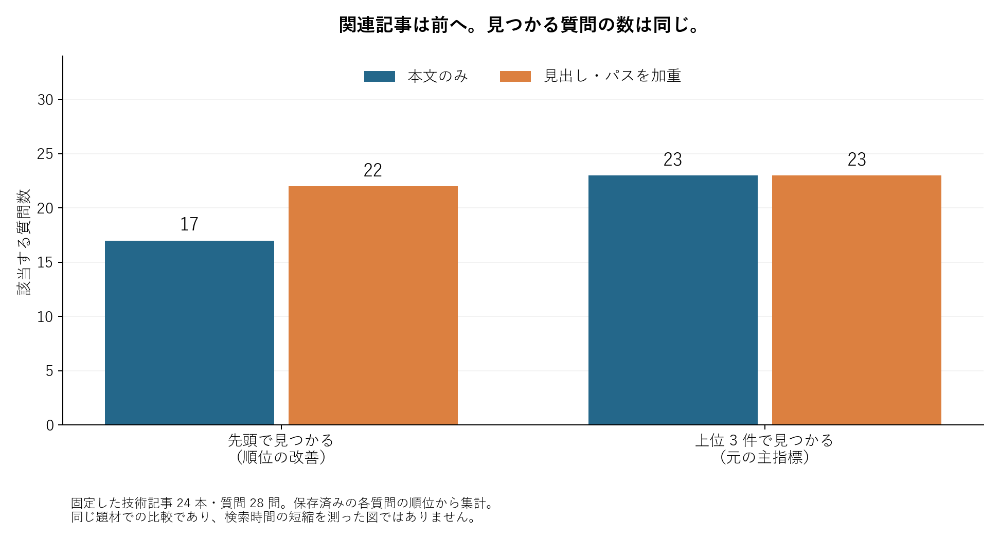

記事検索で見出しを重視すると、関連記事は前に出ました。しかし、上位に答えが見つかる質問は増えませんでした。

手元の技術記事 24 本と質問 28 問で比較したところ、先頭で関連記事が見つかる質問は 17 問から 22 問へ増加。一方、主指標にしていた「上位 3 件に入るか」は、どちらも 23 問でした。見出し加重で主指標が改善する、という当初の仮説は支持されませんでした。

順位を上げたいのか、今まで拾えなかった質問を救いたいのか。同じ「検索の改善」でも、見る数字が変わります。この記事では、その違いが出た質問と、保存した結果を確かめる短いコードを紹介します。

## 上に出ることと、新しく見つかること



図は同じ質問を両方式で評価した実測値です。本文だけで点数を付ける方式と、本文の点数にパス・H1/H2 見出しの点数を 2 倍して加える方式を比べました。本文側にも見出しは残しています。比較相手からタイトルを消して、わざと弱くしたわけではありません。

使ったのは、質問と文書に現れる語から点数を付ける簡略な BM25 検索です。英数字は単語として、日本語や中国語は主に隣り合う文字の組として扱います。両方式で文書、質問、語の分け方をそろえ、変えたのは追加の見出し・パス加重です。

違いが分かりやすかったのは、無害に見える断片を後から結合する「Split Injection」を英語で尋ねた質問でした。答えのある日本語記事は、本文だけでは 3 位、加重すると 1 位になりました。上から読む人には便利そうです。ただ、もともと閲覧範囲に入っていたので、新しく答えを拾えた質問には数えません。

逆の例もあります。Claude Code のカスタムサブエージェントを作るコマンドを英語で尋ねると、対応記事は 15 位から 6 位まで上がりました。順位は大きく動いても、上位 3 件には届きません。順位の変化だけでは、探し物が解決したかは分からないのです。

## 集計を短いコードで確かめる

検証用ディレクトリでは、各質問のランキングと命中判定を `results/experiment/result.json` に保存しています。次のコードは、そのファイルを使って図の集計値を再計算するものです。検索そのものを再実行するコードではありません。

```python
import json
from pathlib import Path

rows = json.loads(
    Path("results/experiment/result.json").read_text(encoding="utf-8")
)["rows"]

for mode in ("body", "body_metadata"):
    first = sum(row[mode]["hit1"] for row in rows)
    within = sum(row[mode]["hit3"] for row in rows)
    print(f"{mode}: first={first}/{len(rows)}, top3={within}/{len(rows)}")
```

保存済みの結果に対して実行すると、次の出力になりました。

```text
body: first=17/28, top3=23/28
body_metadata: first=22/28, top3=23/28
```

集計値だけでは、質問を落としたり、正解文書の対応を間違えたりしても気づけません。そこで各行の `ranking` と `relevant_paths` から最初の正解位置を求め直し、保存済みの命中判定と一致することも確認しました。数字から元の質問と記事へ戻れる形にしておくと、「何が改善したのか」を調べやすくなります。

## 入力を直したら、最初の差が消えた

実験の途中で、検索対象に本文ではない構成案や空ファイルが混ざっていることが分かりました。ファイル名だけでは、執筆指示が中心の下書きを除外できていなかったのです。独立した再実行と原文確認を受けて、対象を技術記事の本文にそろえました。

整理前の主指標は、本文だけが 22 問、加重ありが 23 問。整理後は本文だけでも 23 問になり、差が消えました。質問や重みを結果に合わせて変えたのではなく、検索対象を意図した範囲へ修正し、初回の結果も残しています。

これは、構成案を外した影響だけとは断定できません。BM25 では文書集合が変わると、語の珍しさを表す統計も変わるからです。再現できるコードだけでなく、何を入力と呼ぶかも、結論を左右しました。

## 今回の範囲と、次に確かめたいこと

質問は、独立した AI が記事を読んで作ったものです。実際の検索ログから抽出したものではなく、日本語・中国語・英語を含む小さな手作りの問題集です。埋め込み検索、翻訳、モデルによる並べ替えは比較していません。読者が探す時間も測っていないため、今回の順位改善をそのまま業務時間の短縮とは呼べません。

元の実験では、既知の正解順位から指標を計算する基本的な確認をしていました。今回の記事を見直す際には、正解記事を先頭へ集める並び、末尾へ集める並び、ランダムな並びでも追加確認しました。これは**事後に行った評価方法の確認**です。当初から広い校正を済ませていた、とは扱いません。

この追加確認では、固定した正解ラベルに対して良い並びと悪い並びを区別できました。ただし、正解ラベル自体の完全性を証明したわけではありません。中国語の質問から日本語の LSP 記事を探すなど、単純な語の一致では拾いにくい例も残りました。こうした失敗には、見出しの重みとは別の変更を試す必要があります。

自分の検索で比較するときも、まず「読む順番を良くしたい」のか「拾える質問を増やしたい」のかを決め、同じ質問と入力で比べてみてください。差が出た質問だけでなく、順位が動いても見つからなかった質問を開くと、次に直す場所が見えてきます。
