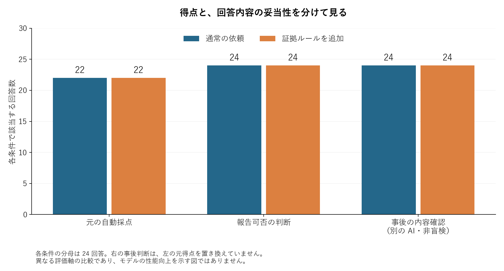

AI のレビューが不正解になったとき、直すべきなのはモデルとは限りません。今回の比較では、自動採点が落とした 4 件を読み直すと、どれも材料に沿った追加指摘を含んでいました。足りなかったのは、採点側の許容範囲でした。

もともとの問いは、証拠確認のルールを追加すると AI が実験報告の問題を見つけやすくなるか、です。自動採点は通常の依頼もルール追加も 22/24。今回の題材では、ルールを追加した側の優位は確認できませんでした。

その比較結果を成功に言い換える代わりに、不合格の理由を調べました。この記事では、モデルの誤りと採点の誤りを分けるために、何を残して読み直したかを紹介します。

## 同じ点数でも、何を間違えたかは別



原実験は 12 種類の短いシナリオを各条件で 2 回ずつ、合計 48 会話でレビューさせたものです。通常の依頼にも、報告してよい結論かを判断する指示と、問題タグの出力形式を渡しています。追加ルール側は、その同じ材料に実験レビューと証拠確認の skill 本文を加えました。

図の左は元の自動採点です。中央は報告可否の判断、右は別の AI が理由と次の行動を読んだ事後の確認です。報告可否は両条件とも 24/24、事後確認でも両条件の 24/24 が妥当と判断されました。右の評価で左の点数を上書きしたわけではありません。

自動採点では、必要な問題を指摘したうえで、許可リストにないタグを出していないことも合格条件にしていました。不合格になった回答を開くと、この最後の条件が原因でした。

## 比較が不公平なら、選び方の問題もある

あるシナリオでは、基準の方法は各問を 1 回だけ試し、候補の方法は 8 回試して最良の結果を採用していました。それなのに、著者は同じ予算で信頼性が上がったと主張しています。

期待したのは `unfair_baseline`、つまり比較条件が公平ではないというタグでした。実際の回答はそれを挙げ、さらに `noise_or_selection` も付けました。理由には、試行回数だけでなく、最良結果を選ぶ方法もそろっていないと書かれていました。

保存した回答と当時の許可リストで、減点箇所を取り出せます。次のコードは実際にそのファイルを読んで実行したものです。

```python
import json
from pathlib import Path

answer = json.loads(Path(
    "results/study/sessions/c02_generic_0/answer.txt"
).read_text(encoding="utf-8"))
reference = json.loads(Path(
    "results/snapshots/reference_answers.json"
).read_text(encoding="utf-8"))["c02"]

extras = sorted(set(answer["issues"]) - set(reference["allowed_issues"]))
print(extras)
```

```text
['noise_or_selection']
```

このタグは余計な思いつきではありません。材料に最良結果の選択が含まれているので、理由のある指摘です。何でもタグを付ければ合格する採点は避けたいですが、許可リストから漏れた指摘をすべて誤りにするのも、別の誤判定を生みます。

別のシナリオでは、ベンダーの文書に機能が使えると書いてあるだけで、自分の環境でも実測確認したと主張していました。回答が付けた「読んだ情報を実測扱いしている」に加えて「確認範囲を越えている」というタグも、自動採点では許可されていませんでした。ここでも、回答を読むと追加指摘の根拠がありました。

## 得点を直す前に、元の記録を残す

原実験の採点器は、明らかな正解・不正解、何でも止める回答、全タグを出す回答で確認していました。それでも、もっともらしい追加指摘をどう扱うかまでは十分に確かめられていませんでした。

そこで回答、参考ラベル、元の自動得点を残し、意味の確認を別の記録にしました。見たのは、指摘の名前だけではありません。「何を根拠に問題だと言ったか」「その理由は材料と矛盾しないか」「次に提案した行動は妥当か」を読みました。

この題材では、必要な問題の検出と核心の処置判断が、通常の依頼でもすでに全件でできていました。同じ問題を何度も追加実行しても、その部分には改善を観測する余地がありません。次にルールの追加効果を調べるなら、許容する指摘の判定方法を先に決め、別の問題集を用意するほうが筋が通ります。

## この比較で分かる範囲

実際に動かしたのはレビュー役の AI です。渡した実験報告は人工的な短い材料で、ファイルやネットワークを調べる操作はさせていません。測ったのは文章内の矛盾や根拠の扱いであり、実際の添付証拠が本物か確かめる能力ではありません。

事後確認は、争点を知った別の AI による判断です。盲検の新しい主指標ではなく、現場での正答率を保証するものでもありません。通常の依頼にも十分な指示があり、矛盾が分かりやすかったことは、追加ルールの差が出なかった説明として残ります。

原実験はモデル名を明示せず、CLI の設定に依存していました。後から gpt-6-astra を明示した同題の追加確認も行い、24 会話で両条件の自動得点はそれぞれ 11/12 でした。これは設定記録を補った追加確認であり、原実験のモデルを事後に確定したものでも、新しい独立題集でもありません。両方とも完全なシステム側の文脈は固定していません。

レビューの点数が悪かったら、まず落ちた回答を開いてみる。モデルを直すべきなのか、正解リストを直すべきなのかは、その中身を見てから決められます。
